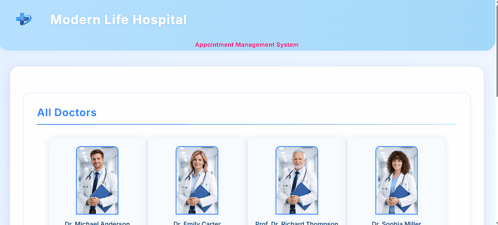

# 🏥 Hospital Appointment System

💻 Live Demo:  
https://appointment-hospital-system.netlify.app/

---

## 📖 Description

A responsive React application for managing hospital appointments.

Users can:
- browse doctors,
- create appointments,
- manage patient records,
- mark appointments as completed,
- and store all data in localStorage.

---

## 🎦 Preview



---

## ✨ Features

- Doctor listing system
- Appointment booking
- Appointment filtering
- Mark as completed
- Delete appointment
- LocalStorage persistence
- Form validation
- Responsive Bootstrap layout

---

## 🛠 Tech Stack

| Technology | Version |
|---|---|
| React | 19 |
| React Bootstrap | 2 |
| Bootstrap | 5 |
| React Icons | 4 |
| react-uuid | 2 |

---

## 🧩 Project Structure

```bash
src/
├── App.js
├── App.css
├── index.js
│
├── assets/
│   ├── doctors
│   └── logo
│
├── components/
│   ├── AddPatient.jsx
│   ├── Doctors.jsx
│   └── PatientList.jsx
│
├── helper/
│   └── Data.jsx
│
└── pages/
    └── Home.jsx
```

---

## ⚙️ Installation

```bash
git clone https://github.com/cankurtduygu/hospital-appointment-system

cd hospital-appointment-system

npm install

npm start
```

---

## 📱 Responsive Design

- Desktop support
- Tablet support
- Responsive Bootstrap grid system

---

## 🚀 Future Improvements

- Search functionality
- Appointment editing
- Authentication system
- Backend integration

---

## 📁 Source Code

GitHub Repository:  
https://github.com/cankurtduygu/hospital-appointment-system
